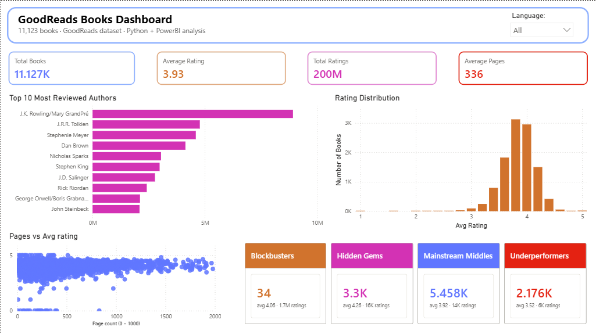

# GoodReads Books Analysis

A data analysis project using Python and PowerBI to explore patterns in book 
ratings and popularity across 11,000+ books from the GoodReads dataset.

## Dataset
GoodReads Books dataset from Kaggle — 11,123 books with ratings, authors,
page counts, publishers, and review counts.

## Analysis

### Exploratory Analysis
- **Top 10 Most Reviewed Authors** — aggregated total ratings by author
- **Rating Distribution** — distribution of average ratings across all books
- **Pages vs Rating** — scatter plot exploring relationship between page count 
  and average rating

### Machine Learning
- **Linear Regression** — predicted book ratings from page count and ratings 
  count (R² = 0.03, suggesting these are weak predictors of reader satisfaction)
- **K-Means Clustering** — grouped books into 4 clusters by rating and popularity:
  - Blockbusters (high rating, massive popularity)
  - Hidden Gems (highest rating, moderate popularity)
  - Mainstream Middles (average rating, moderate popularity)
  - Underperformers (low rating, low popularity)
- **Random Forest Classification** — predicted whether a book would be highly 
  rated (≥4.0) based on page count, ratings count, and review count.
  Achieved 58% accuracy — better than random but suggests these features 
  alone don't fully capture what makes a book well-received.

## Key Findings
- Most books cluster between 3.5 and 4.5 on average rating
- Page count and popularity are weak predictors of rating (R² = 0.03)
- The same book series can appear across multiple clusters due to edition 
  differences, highlighting how data quality affects ML results
- Random Forest feature importance showed ratings count and page count 
  were nearly equal predictors of whether a book is highly rated

## Files
- `analysis.py` — full Python analysis script
- `goodreads-dashboard.pbix` — PowerBI dashboard file
- `books_clustered.csv` — dataset with cluster labels added by K-Means model

## Libraries
- pandas
- matplotlib
- scikit-learn

## Dashboard Preview



*Built in PowerBI — interactive filtering by language across all visuals*

## Visualizations

### Top 10 Most Reviewed Authors


### Rating Distribution


### Book Clusters by Popularity and Rating


## How to Run
```bash
pip install pandas matplotlib scikit-learn
python analysis.py
```