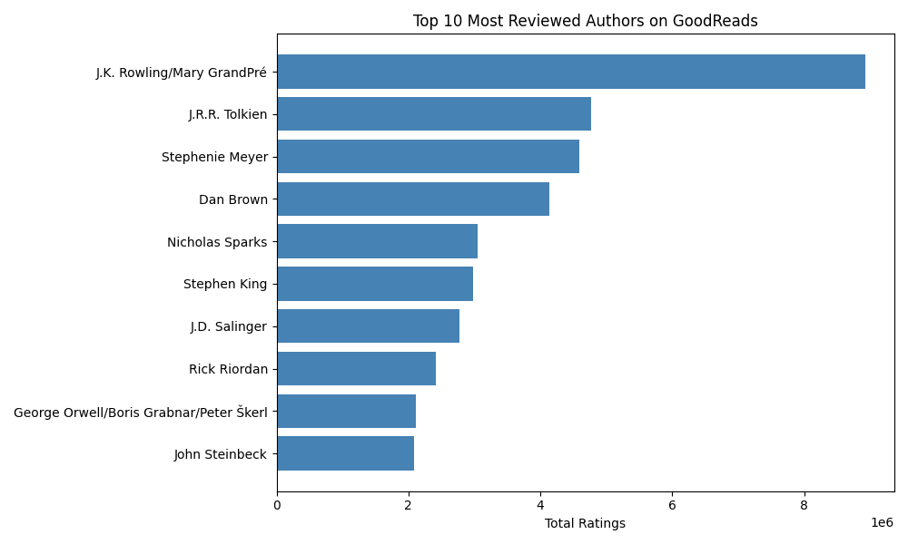
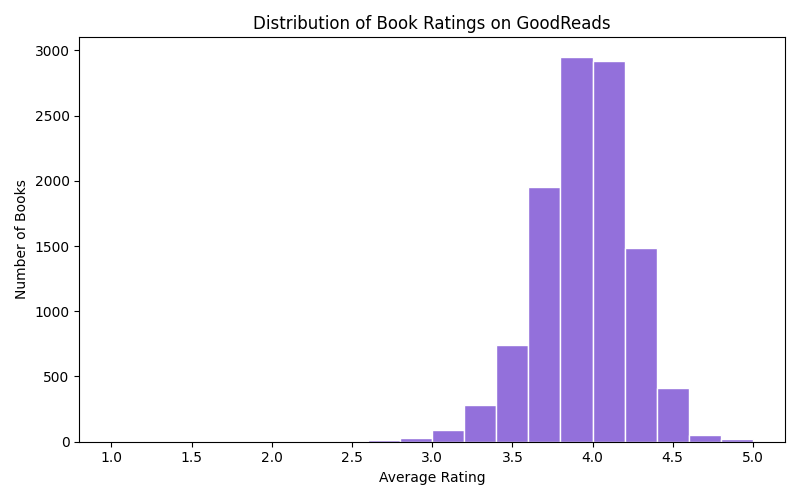
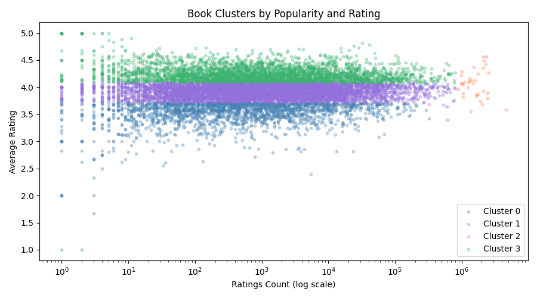

# GoodReads Books Analysis

A data analysis project using Python, pandas, scikit-learn, and matplotlib
to explore patterns in book ratings and popularity.

## Dataset
GoodReads Books dataset from Kaggle — 11,000+ books with ratings, authors,
page counts, publishers, and review counts.

## Analysis

### Exploratory Analysis
- **Top 10 Most Reviewed Authors** — aggregated total ratings by author
- **Rating Distribution** — histogram showing how ratings spread across all books
- **Popularity vs Rating** — scatter plot exploring the relationship between
  ratings count and average rating

### Machine Learning
- **Linear Regression** — predicted book ratings from page count and ratings
  count (R² = 0.03, suggesting these are weak predictors of reader satisfaction)
- **K-Means Clustering** — grouped books into 4 clusters by rating and popularity:
  - Underperformers (low rating, low popularity)
  - Mainstream Middles (average rating, moderate popularity)
  - Blockbusters (high rating, massive popularity)
  - Hidden Gems (highest rating, moderate popularity)
- **Random Forest Classification** — predicted whether a book would be highly
  rated (≥4.0) based on page count, ratings count, and review count.
  Achieved 58% accuracy — better than random but suggests these surface-level
  features don't fully capture what makes a book well-received.

## Key Findings
- Popular books tend to be highly rated but popularity alone doesn't guarantee it
- Page count is nearly as predictive as popularity when classifying highly rated books
- The same book series can appear in multiple clusters due to edition differences,
  highlighting how data quality affects clustering results

## Libraries
- pandas
- matplotlib
- scikit-learn

## Visualizations





## How to Run
```bash
pip install pandas matplotlib scikit-learn
python analysis.py
```